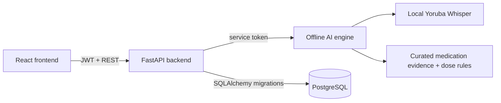

# CLINIQ-FLOW

CLINIQ-FLOW is a full inpatient and outpatient EMR for public hospitals. It gives clinical teams an auditable record of care while adding focused decision support at the moments that carry the most risk: triage, consultation documentation, and paediatric medication dosing.

It supports clinicians; it does not diagnose, prescribe automatically, or replace clinical judgement.

## Current scope

- Patient registration, visits, triage, doctor queues, consultation records, and clinical forms
- Outpatient departments, emergency units, specialty clinics, wards, beds, admissions, transfers, nursing observations, medication administration, and discharge summaries
- Pharmacy medication worklists, dispensing records, invoices, payments, and payment confirmation
- Admin-managed starter hospital catalogue (departments, locations, wards, clinics and beds) that can be extended for each hospital
- Role-based workflows for admin, record officer, nurse, doctor, pharmacist, laboratory scientist, and billing officer
- Audit events for sensitive EMR and billing actions

## AI decision support

1. **Offline Yoruba/English transcription.** The AI engine embeds an int8 CTranslate2 conversion of `LyngualLabs/whisper-small-yoruba`. It runs without a paid transcription API, network model download, or speaker diarization.
2. **Structured clinical notes and SOAP draft.** Transcript processing is currently deterministic and rule-based, producing structured findings, confidence signals and an editable SOAP draft. It is not a paid generative AI call.
3. **Paediatric dose safety and medication evidence.** The medication service retrieves curated evidence and applies explicit dose rules using the child’s age, weight, dose, frequency and route. It flags concerning or incomplete orders for clinician review; it never prescribes or blocks the doctor’s clinical judgement. The current drug rule set is deliberately small and must be clinically governed and expanded before production use.

The doctor consultation workflow is connected to transcript-to-SOAP and dose checking. All AI output remains an editable decision-support aid, with final clinical responsibility held by the authenticated clinician.

## Architecture



### Supabase position

Supabase can remain in phase one for authentication and, if approved for the hospital’s data-governance requirements, managed PostgreSQL. The FastAPI backend is the only application layer allowed to write clinical, medication, billing, and audit data. Do not let the frontend write EMR tables directly through the Supabase client. Use one PostgreSQL source of truth, apply the migrations in `backend/database/migrations`, enforce server-side role checks, and keep Supabase service-role credentials only on the backend.

For an offline/on-premises hospital deployment, the same backend can use self-managed PostgreSQL instead. Payment card data must never be stored in this application; store only processor references and payment status.

## Services

| Service | Location | Responsibility |
| --- | --- | --- |
| Frontend | `frontend/` | Role-based clinical and administrative workspaces |
| Backend | `backend/` | EMR APIs, permissions, audit trail, billing and AI orchestration |
| AI engine | `ai_engine/` | Offline ASR, deterministic SOAP structuring, medication retrieval and dose validation |

## Local setup

1. Configure the backend and AI environment files from their `.env.example` files. Use a strong, matching `AI_ENGINE_TOKEN`; it is an internal service token, not an OpenAI key.
2. Set `DATABASE_URL` to PostgreSQL, create the legacy baseline once with `python database/schema.py`, then apply reviewed migrations with `python -m database.migrate`.
3. Build the AI engine image. Its Docker build converts and embeds the approved Yoruba Whisper checkpoint. No local Hugging Face cache is required at runtime.
4. Start the AI engine on port 8001, backend on port 8000, and frontend on port 5173.

```powershell
cd backend
.\.venv\Scripts\python.exe -m pytest -q

cd ..\frontend
npm run build
```

Backend API documentation is available at `http://127.0.0.1:8000/docs`; AI-engine documentation is at `http://127.0.0.1:8001/docs`.

For staging and production release gates, database migration procedure, TLS
boundary, offline-model provisioning, and rollback expectations, follow
[DEPLOYMENT_READINESS.md](DEPLOYMENT_READINESS.md). This project is not
deployment-ready until every listed staging check has evidence of completion.

## Production readiness notes

- Validate ASR with representative Nigerian English and Yoruba recordings before clinical rollout.
- Clinical leadership must approve every dosage rule, source document, alert threshold, and override policy.
- Deploy HTTPS, managed secrets, encrypted backups, least-privilege database roles, MFA, session expiry, immutable audit retention, and tested disaster recovery.
- Review every role workflow with clinical users before patient-data rollout, including the remaining legacy nurse data paths.
